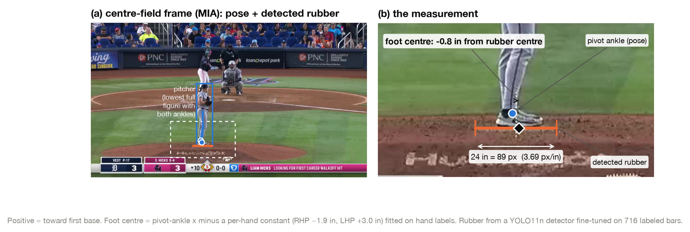
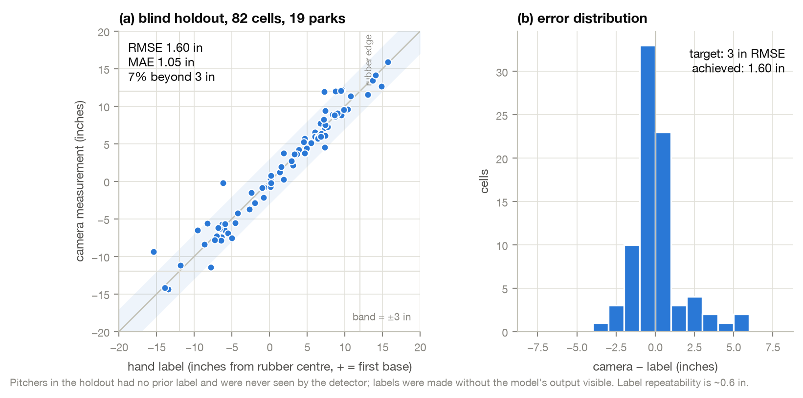
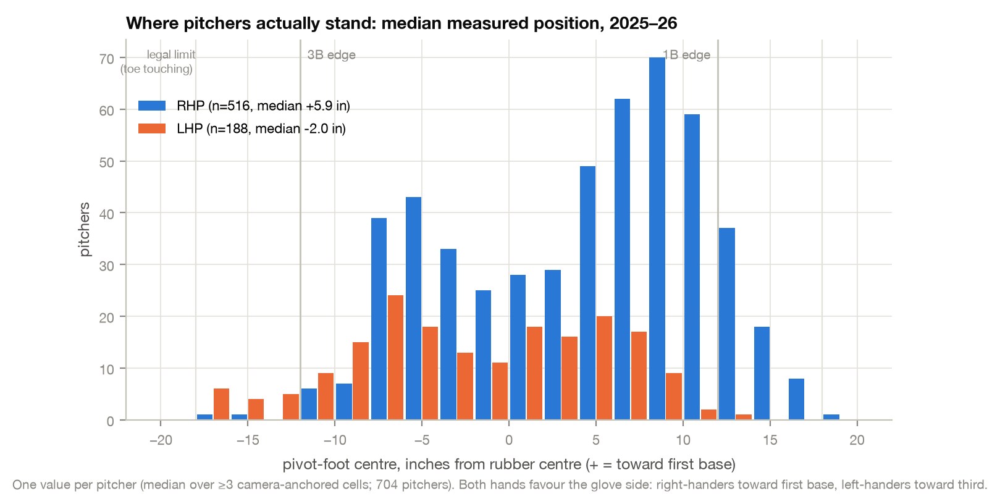
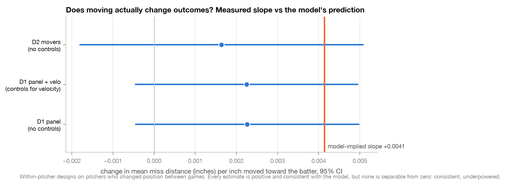
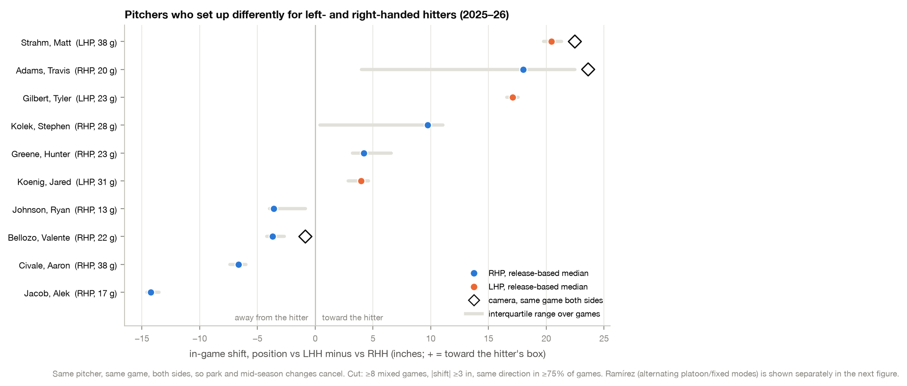
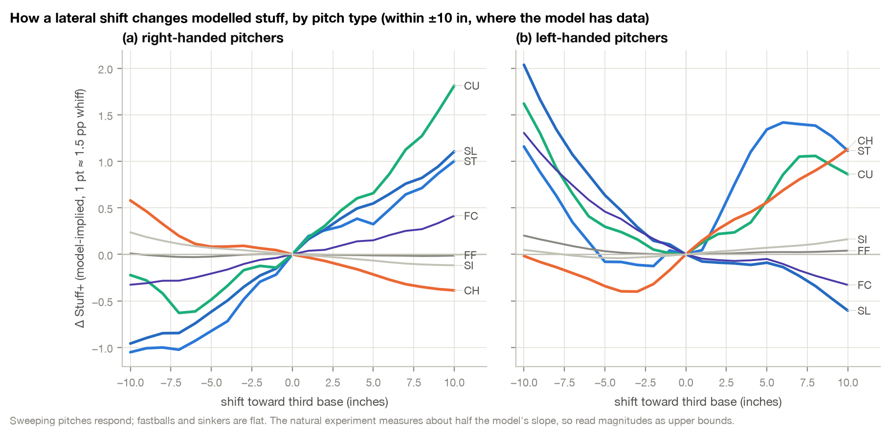

# Rubber Position from Broadcast Video

**Where does a pitcher actually stand on the rubber — and does it matter?**

This repository measures every MLB pitcher's absolute position on the pitching rubber from the free center-field clips on Baseball Savant, to about **1.5 inches**, with roughly one hour of human labeling in total. It then asks what that position is worth, and answers honestly: the measurement is solid, the effect of moving is small and consistent with the model but not yet separable from zero.



---

## Why this is worth using

**1. It measures something Statcast cannot.**
Statcast publishes `release_pos_x`, the horizontal release point in feet. That tracks *relative* movement beautifully (pitch-to-pitch noise ≈ 0.1 ft), but it has no origin: it cannot tell you whether a pitcher is standing in the middle of the rubber or with his toe hanging off the first-base end. Position on the rubber is a *constrained* quantity — the rubber is 24 inches wide and a pitcher already at the edge has nowhere to go — and only video can supply the anchor. This pipeline supplies it for 83% of 2025 pitchers and 78% of 2026 pitchers, covering ~90% and ~83% of fastballs.

**2. It is accurate, and the accuracy was measured blind.**
On 82 cells from pitchers the detector had never seen, labeled with the model's output hidden, the camera measurement is **1.60 in RMSE** against hand labels (1.05 in MAE, 7% beyond 3 in). Hand-label repeatability itself is ~0.6 in. The target was 3 inches.



**3. It needs almost no labeling.**
The foot is located by a *pretrained* pose model (YOLO11-pose); it required zero training data — a per-hand constant (heel-to-centre offset, RHP −1.9 in, LHP +3.0 in) is the only fitted parameter. The rubber is found by a small detector fine-tuned on the bar ends already present in a few hundred existing labels. The whole human budget was ~65 minutes, most of it spent on *verifying* proposals (Enter to accept) rather than clicking. Doubling the training data did not improve the detector: it is saturated at the label noise floor.

**4. It is self-calibrating.**
The rubber is a known 24-inch object in the same frame as the foot, so it supplies both the origin and the pixel scale per frame. Park, camera zoom, and pan drop out. Two cheap consistency gates — detector confidence, and the pitcher's height-to-rubber-width ratio (≈3.2 in a real center-field shot) — reject close-up replays and mis-detected bars, cutting same-game disagreement between a pitcher's two cells from 5.6 to 3.1 in RMS.

**5. It produces new baseball facts.**
- Both hands set up on the **glove side**: RHP median +5.9 in toward first base, LHP median −2.0 in toward third.
- **21 pitchers consistently shift by batter side**; six are camera-confirmed in the same game, both sides (Strahm +22 in, Adams +24 in, Tate +7 in, Wilson, Koenig, Civale). About half move toward the hitter, half away.
- **Yohan Ramírez** stood in one spot for five seasons, moved 14 inches on the day he joined the Dodgers, and began a two-spot platoon split on Aug 19, 2025.
- Lateral position acts almost entirely through **sweeping pitches**; fastballs and sinkers are indifferent to it.



**6. It is honest about the effect size.**
A model-implied gain of +2 Stuff+ (≈ +3 pp whiff per swing, ≈ 20 K and 0.5 WAR for a full-season starter) is the *upper* end. Within-pitcher natural experiments on pitchers who actually moved recover about half the model's slope, with confidence intervals that include zero. The repository carries that validation as a first-class output rather than a footnote.



---

## How it works

```
Savant play IDs ──► clip URLs ──► set-position frame ──► pose (foot) + detector (rubber) ──► inches
      01              02/03            03                        04j                        05
                                                                                            │
                                     natural experiment (06) ◄── per-pitcher anchors ◄──────┘
                                     counterfactual sweep (07/08) ── Stuff+ model (stuff_platoon_*)
```

| Stage | Script | What it does |
|---|---|---|
| 1 | `rubber_01_playids.py` | Harvests `playId` GUIDs per pitch from MLB StatsAPI (566 KB/game, 4.6× cheaper than Savant's feed); joins to Statcast at 99.7%. |
| 2 | `rubber_02_select_clips.R`, `rubber_02b_fetch_targets.R` | Picks one representative pitch per pitcher-game-side, preferring the stretch (a mandated stop puts the pivot foot flat against the rubber), early innings (undisturbed mound), and parks where the rubber is readable. |
| 3 | `rubber_03_fetch_frames.py` | Range-fetches the MP4 (`moov` atom is at the end), finds the live center-field segment by scene cut + turf/dirt hue, locates motion onset, and saves the last stationary frames before delivery plus an unoccluded median background. |
| 4 | `rubber_04j_pose_measure.py` | The measurement. Pose → pitcher = lowest full figure with both ankles → gate (feet level, knees down, feet together) → pivot ankle → 512×192 crop → rubber detector on the background image → inches. Also `--eval`, `--refilter`, `--make-pack`. |
| 4 (labeling) | `rubber_04c_label_server.py` | Browser labeler with **verify mode**: proposals pre-placed, Enter accepts, click moves a marker, typed skip reasons. |
| 5 | `rubber_05_calibrate.R` | Merges labels + camera cells; per-pitcher **anchors** carry a measurement to that pitcher's other games via `release_pos_x`; pooled fallback for unmeasured pitchers. |
| 6 | `rubber_06_natural_experiment.R` | Two-way fixed-effects panel, movers-only, and platoon double-difference designs on pitchers who changed position. |
| 7–8 | `rubber_07_counterfactual.R`, `rubber_08_handedness_pitchtype.R` | Shift `release_pos_x`, recompute horizontal approach angle exactly, rescore with the platoon Stuff+ model, sweep the legal window, clip to each pitcher's observed range. |
| figures | `rubber_10_paper_figures.py` | Regenerates every figure in `figures/` from the pipeline outputs. |
| leaderboard | `rubber_11_leaderboard.py` | Writes `docs/LEADERBOARD.md`: single-spot movers, platoon switchers, and the measured value of existing shifts, with arsenal breakdowns and season projections. |

### The two ideas that made it work

**Don't train a foot detector.** A custom keypoint CNN trained on 375 crops plateaued at 5.8 in. A pretrained pose model, run once on the full 1280×720 frame, put the pivot ankle within 1.4 in of the clicked foot centre after a constant offset — with no training at all. The remaining error was the rubber and the frame selection, both of which existing labels could fix.

**Judge every model version on a blind holdout, paired per frame.** A retrain that raised validation mAP from 0.69 to 0.85 was *worse* on the golden set (1.30 → 2.15 in) because its validation split contained the model's own accepted proposals. Versioned weights and a never-trained-on golden pack are enforced in the code (`HOLDOUT_PACKS`).

---

## Results at a glance

| | Value |
|---|---|
| Per-frame accuracy, blind holdout | 1.60 in RMSE (cell), 1.31 in (same frame) |
| Pitchers directly measured | 2025: 665 / 798 (83%) · 2026: 592 / 756 (78%) |
| Camera-anchored pitchers in the deliverable | 809 (from 168 with hand labels alone) |
| Anchor path (carry a measurement to other games) | 2.66 in MAE / 3.96 in RMSE — game-to-game setup drift, not measurement error |
| Parks where the rubber is readable | 21 of 28 (TEX/COL/MIA ≈ 85% yield; PIT 29%, PHI 10%) |
| Human labeling used | ~65 minutes (100 blind cells + 390 verify cells) |
| Model-implied value of a 6-in move | ≈ 0.2 Stuff+ league-average; up to ≈ 2 Stuff+ for sweeper-heavy arsenals |
| Measured slope vs model | +0.0023 ± 0.0014 vs +0.0041 in of miss per inch — consistent, underpowered |





---

## Who should move? — the leaderboard

Full detail, with per-pitcher arsenal breakdowns and projections, is in **[docs/LEADERBOARD.md](docs/LEADERBOARD.md)** (regenerated by `pipeline/rubber_11_leaderboard.py`). Two lists, because they are different recommendations, and pitchers who *already* shift by batter side are excluded from both.

**A. Single-spot movers** — stand somewhere else, for everyone (in-support gains, model-implied):

| Pitcher | Move | Stuff+ | What drives it | Season projection | Credibility |
|---|---|---|---|---|---|
| Chris Bassitt (R) | 13 in toward 3B | +2.13 | curveball +7.5 | +20 K, 5.8 runs, +0.6 WAR | 13-in range from release scatter — caution |
| Sean Manaea (L) | 13 in toward 1B | +1.79 | sweeper +4.2, cutter +4.8 | +15 K, 4.7 runs, +0.5 WAR | caution |
| Ryan Thompson (R) | 3 in toward 3B | +1.65 | slider +4.6 | +5 K, 1.4 runs, +0.15 WAR | **credible** (4-in range, dense data) |
| Wandy Peralta (L) | 12 in toward 3B | +1.50 | RHH side only | +7 K, 2.1 runs, +0.2 WAR | caution |
| Jacob Lopez (L) | 3 in toward 1B | +1.09 | slider +2.9 | +7 K, 2.2 runs, +0.2 WAR | **credible** (3-in range) |

**B. Platoon switchers** — adopt two spots, as Strahm and Adams do:

| Pitcher | LHH spot / RHH spot | Stuff+ | Of which from splitting | Season projection |
|---|---|---|---|---|
| Spencer Arrighetti (R) | +8 in / −8 in (toward hitter) | +1.27 | +0.50 | +8 K, 2.3 runs, +0.24 WAR |
| Anthony Banda (L) | −5 in / +9 in (away) | +1.16 | +0.23 | +4 K, 1.3 runs, +0.13 WAR |
| Abner Uribe (R) | +3 in / −3 in (toward) | +0.87 | +0.21 | +3 K, 1.0 runs, +0.10 WAR — **credible** |
| Garrett Whitlock (R) | +8 in / −10 in (toward) | +0.79 | +0.52 | +3 K, 1.1 runs, +0.11 WAR |
| Trevor Rogers (L) | +9 in / −9 in (toward) | +0.76 | +0.28 | +7 K, 2.2 runs, +0.23 WAR |

Scale: 1 Stuff+ ≈ 1.5 pp whiff per swing ≈ 1.3 pp K% ≈ 1–1.5 mph of velocity. Halve everything if you take the natural experiment at face value. The mechanism is nearly always one breaking ball: a lateral shift helps a sweeping pitch to same-side hitters and hurts it to opposite-side hitters, while fastballs are indifferent — which is why Strahm's split is worth +0.40 Stuff+ over one spot (slider vs LHH) and Ramírez's is worth −0.22 (his sweeper works to both sides from the 3B end).

---

## Running it

```bash
python -m venv .venv && . .venv/bin/activate
pip install -r requirements.txt            # R: install.packages(c("data.table","lightgbm","jsonlite"))

# 1. play IDs and clip manifest for a season
python pipeline/rubber_01_playids.py --season 2026
Rscript pipeline/rubber_02_select_clips.R --season 2026
Rscript pipeline/rubber_02b_fetch_targets.R --season 2026

# 2. frames (4 workers; 8 overwhelms the clip host)
python pipeline/rubber_03_fetch_frames.py --season 2026 --manifest data/rubber/fetch_targets_2026.csv --workers 4

# 3. measure every frame with the shipped detector (models/rubber_det.pt)
cp models/rubber_det.pt data/rubber/rubber_det.pt
python pipeline/rubber_04j_pose_measure.py --measure 2026

# 4. calibrate and run the downstream analysis
Rscript pipeline/rubber_05_calibrate.R
Rscript pipeline/rubber_06_natural_experiment.R
Rscript pipeline/stuff_platoon_features.R && Rscript pipeline/stuff_platoon_train.R
Rscript pipeline/rubber_07_counterfactual.R && Rscript pipeline/rubber_08_handedness_pitchtype.R

# 5. figures and leaderboard
python pipeline/rubber_10_paper_figures.py
python pipeline/rubber_11_leaderboard.py
```

Statcast per-pitch CSVs are expected at `data/statcast_<season>/statcast_<season>_all.csv` (the standard Savant search export). Everything under `data/` is git-ignored and regenerates.

To retrain the rubber detector on new labels (golden packs are excluded automatically):

```bash
python pipeline/rubber_04j_pose_measure.py --build-dataset
python pipeline/rubber_04j_pose_measure.py --train --weights data/rubber/rubber_det_new.pt
python pipeline/rubber_04j_pose_measure.py --eval --weights data/rubber/rubber_det_new.pt   # promote only if the golden set improves
```

Conventions: positive x is toward **first base** (Statcast's sign); image-left is first base in the center-field view. Foot centre may legally sit up to ±18 in from rubber centre (24-in rubber, 6-in half-shoe, toe or heel in contact).

---

## What's in `results/`

| File | Contents |
|---|---|
| `rubber_move_gains.csv` | Per-pitcher single-spot optimum, in-support and unconstrained, with room and validation flags |
| `rubber_move_sweep.csv` | The full per-pitcher × shift × side sweep the leaderboard is built from |
| `rubber_arsenal_detail.csv` | The same decomposed by pitch type |
| `rubber_sweep_by_pitchtype.csv`, `rubber_sweep_by_hand.csv` | Δ Stuff+ vs shift curves |
| `rubber_policy_comparison.csv` | Stay put / all-3B / arm-side / toward-batter / per-side oracle |
| `rubber_natural_experiment.csv` | D1/D2/D3 slopes with CIs, all outcomes |
| `rubber_channel_decomp.csv` | Why a physics-only HAA channel is ruled out |
| `park_eligibility.csv` | Camera-angle triage by park |

`models/rubber_det.pt` is the shipped rubber detector (YOLO11n, 5 MB); `models/rubber_pose_calib.json` holds the per-hand ankle offsets.

---

## Limitations, stated plainly

- **Seven parks are unreadable** (rubber buried in mound dirt or a camera that never shows the mound flat-on). Pitchers who appear only there stay on the pooled fallback (~4 in MAE).
- **The anchor path is ~4 in**, not 1.5. Carrying one game's measurement to another game assumes the pitcher didn't move; many do. More measured games per pitcher is the fix, and the pipeline makes those cheap.
- **Effect sizes are model-implied.** The natural experiment supports the sign and rough size but cannot separate the effect from zero. Treat the leaderboards as rankings of who has the most to gain *if* the mechanism holds.
- **Stuff isn't results.** Ramírez's own history is the caution: he switched spots and his walk rate went up.
- Video is available for 2020 onward only where Savant hosts clips; play IDs were harvested fully for 2025–26.

---

## Acknowledgements

Built on Baseball Savant / MLB StatsAPI public endpoints, Ultralytics YOLO11 (pose and detection), LightGBM, and data.table. The frame-selection idea of requiring a live-pitch clock rather than the first field-looking segment was sharpened by reading [tomdoyo/open-command](https://github.com/tomdoyo/open-command).
